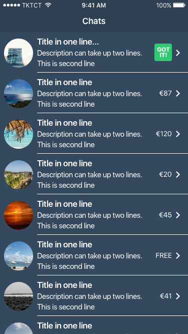
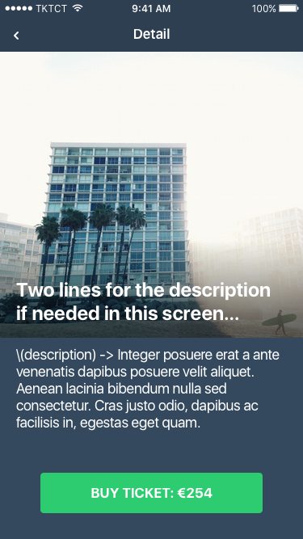
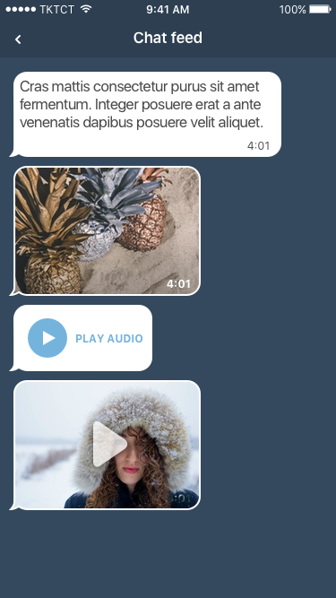

# TicketChat 
## iOS Technical Test

We have created a small technical test for you to showcase how you work. Your task will be to create a small iOS Application that should request a lists of chats and buy tickets for this chats.

### Challenges

* You are required to code in Swift 3.
* Fetch and parse JSON data into `structs` from API.
* Implement chats list and chat detail screen with UX provided.
* User could buy a ticket on detail chat view only on chats with ticket 
value as false. 

	> You need to make a `POST chats/:id/ticket` request. </br> 
	> This endpoint always return the same model with value changed to `ticket = true`.

#### Bonus Points

* Make a persistent layer with Core Data.
* Style example with provided UI.
* Implement messages feed screen.
* Routing to messages feed on chats with `ticket = true`.

#### API

The following endpoint `https://challenge.nc43tech.com` responds with JSON data. The API requires you to specify a valid authorization header.

`Authorization: Bearer AbCdEf123456`

#### GET `https://challenge.nc43tech.com/chats`
```json 
[
  {
    "id": "ad924fb8-4942-4fe7-13d2-1afbfbe13929",
    "title": "iOS Technical Test Chat",
    "description": "ya tu sabes.",
    "thumbnail": "https://unsplash.it/375/?random",
    "price": "0.00",
    "ticket": false
  },
]
```

You can preview the request in the terminal.
> $ curl -H 'Authorization:Bearer AbCdEf123456' https://challenge.nc43tech.com/chats

#### POST `https://challenge.nc43tech.com/chats/:id/ticket`
```json 
{
  "id": "ad924fb8-4942-4fe7-13d2-1afbfbe13929",
  "title": "iOS Technical Test Chat",
  "description": "ya tu sabes.",
  "thumbnail": "https://unsplash.it/375/?random",
  "price": "0.00",
  "ticket": true
}
```

#### GET `https://challenge.nc43tech.com/chats/:id/messages`
```json 
[
  {
    "id": "f7c2e343-bfd7-4efa-bef5-d09ff2351337",
    "sent": "2009-09-05T15:55:30Z",
    "type": "text",
    "content": " ¯\_(ツ)_/¯"
  },
]
```

### UI

<div style="text-align:center">
	
	
	
</div>

### Review

We value quality over feature-completeness. We do take into consideration your experience level. The goal of this code sample is to help us identify what you consider production-ready code. 
The aspects of your code we will assess include:

* **Architecture**: how clean is the separation between layers
* **Correctness**: does the application do what was asked? 
* **Code quality**: is the code simple, easy to understand, and maintainable? Are there any code smells or other red flags? Does object-oriented code follows principles such as the single responsibility principle? Is the coding style consistent with the language's guidelines? Is it consistent throughout the codebase?
* **Technical choices**: do choices of libraries, architecture etc. seem appropriate for the chosen application?


### Aditional Information

We understand that you’ve probably got a full-time job and a personal life so doing the above test could be definitely finished in a couple of hours.

If you have any questions, email us and we can add it to this readme.

Good luck!